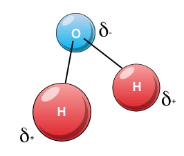

# Water (work in progress)

18.09.2023

___

## Features

> **cohesion** - The intermolecular attraction by which the elements of a body are held together.\
> **adhesion** - The physical attraction or joining of two substances, especially the macroscopically observable attraction of dissimilar substances.\
> **transpiration** - evaporation but from the surface of plants.\
> **hydrophilic** - substances that *like* water.

- two hydrogen atoms and one oxygen atom creating an dipole  
- has two covalent bonds
- tasteless, odorless, colorless
- cohesive
- adhesive
- forms hydrogen bonds
- surface tension, [see lizard](https://www.youtube.com/watch?v=CW0TijmAUqY)
- seen on Earth in all three stages
- high heat capacity
  